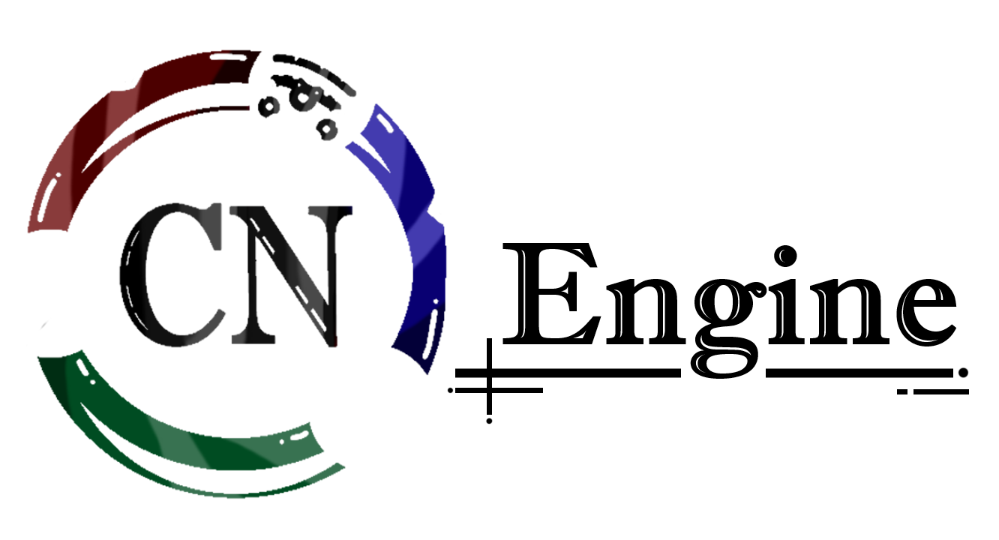

<a href="https://github.com/Goldenapple3619/CNEngine">

<picture>
  <source media="(prefers-color-scheme: dark)" srcset="./assets/images/banner_dark_XL.png">
  
</picture>

</a>


<div align="center">
  
[](https://github.com/Goldenapple3619/CNEngine/graphs/contributors)  [](https://github.com/Goldenapple3619/CNEngine/blob/dev/LICENSE) [](https://github.com/Goldenapple3619/CNEngine/actions/workflows/build.yml) [](https://github.com/Goldenapple3619/CNEngine/actions/workflows/documentation.yml)

</div>

## Table of content
<ol>
  <li><a href="#overview">Overview</a></li>
  <li><a href="#built-with">Built With</a></li>
  <li><a href="#projects-using-cnengine">Projects using CNEngine</a></li>
  <li><a href="#prerequisites">Prerequisites</a></li>
  <li>
    <a href="#how-to-build">How to build</a>
    <ul>
      <li><a href="#windows-using-msys">Windows using MSYS</a></li>
      <li><a href="#windows-using-wsl">Windows using WSL</a></li>
      <li><a href="#linux">Linux</a></li>
      <li><a href="#macos">MacOS</a></li>
    </ul>
  </li>
  <li><a href="#contributors">Contributors</a></li>
  <li><a href="#license">License</a></li>
  <li><a href="#faq">FAQ</a></li>
  <li><a href="#contact">Contact</a></li>
</ol>

## Overview
This project is a complete game engine programmed in C that allow 2d rendering, 3d rendering, GUI rendering.

Higly configurable on the back technology allow the usage of multiple graphics api (via SDL surface, SDL renderer, OpenGL context, ...) and to render using CPU or GPU.

## Built with
<div align="center">
  


  
</div>

## Projects using CNEngine
|Name|Description|By|Website|
|---|---|---|---|
|**Alice - Gunz & Arrests**|*Still in developement*|**CNStudio™**|*Not avaiable until end of developement of the game and the engine itself*|

## Prerequisites
- CMake
- Make
- GCC (mingw for Windows)
- LIBC
- LIBM
- python-jinja (jinja2)

## How to build

*Before installing make sure you have every prerequisites installed (libm, libc are most of the time install with the mingw / gcc package).*

### Windows using MSYS
```shell
  git clone https://github.com/Goldenapple3619/CNEngine.git && cd CNEngine
  
  # if you're executing outside of MSYS (make sure binaries are exposed in $PATH):
  cmd.exe /c scripts\build_windows-${ARCH}.bat

  # or if you're inside of MSYS
  sh scripts/build_windows-${ARCH}.sh
```

### Windows using WSL
```shell
  git clone https://github.com/Goldenapple3619/CNEngine.git && cd CNEngine

  sh scripts/build_wsl-${ARCH}.sh
```

### Linux
```shell
  git clone https://github.com/Goldenapple3619/CNEngine.git && cd CNEngine

  sh scripts/build_linux-${ARCH}.sh
```

### MacOS
```shell
  git clone https://github.com/Goldenapple3619/CNEngine.git && cd CNEngine

  sh scripts/build_macos-${ARCH}.sh
```

## Documentation
Code documentation available via the doxygen at [https://Goldenapple3619.github.io/CNEngine](https://Goldenapple3619.github.io/CNEngine/) or by compiling the doc with:
```shell
  doxygen doc/doxygen/doxydoc
```

## Contributors
<a href="https://github.com/Goldenapple3619/CNEngine/graphs/contributors">
  
</a>

## License
See [LICENSE](https://github.com/Goldenapple3619/CNEngine/blob/dev/LICENSE) for more information.

## FAQ
- **Can I use this engine to release commercial products?**
> *No.*

- **Can I experiment using the engine and build personal project with it?**
> *Yes, but credit the engine and keep the license.*

- **Can I read the code to inspire when building my own engine?**
> *Yes, but don't do a copy/paste of the codebase itself.*

- **Can I contribute to this repo by doing a PR?**
> *If you're reading the FAQ section, there's 99.99% of chance that the anwser is no, but you can still give suggestion / report bugs.*

## Contact
For more infos, join the [Discord server](https://discord.gg/F34jV23hjd).
